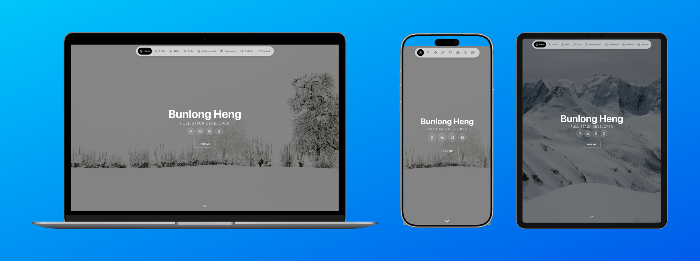
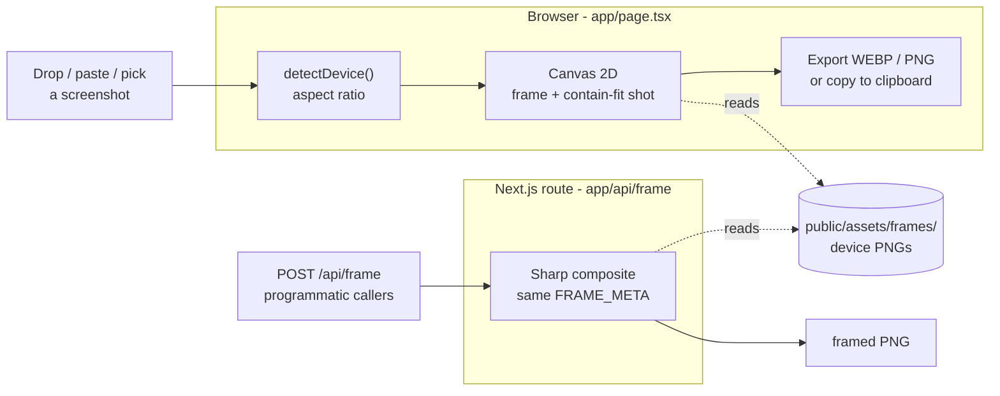
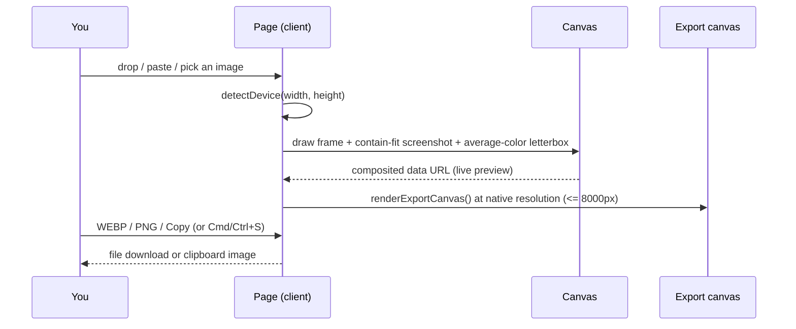

# Frames

Drop a screenshot and get back a polished device mockup - your image composited into a realistic Apple frame (iPhone, iPad, MacBook, iMac, Studio Display), ready to export as WEBP or PNG or copy straight to the clipboard. Everything runs in the browser; a matching HTTP API does the same server-side for programmatic callers.



[](LICENSE)


## Contents

- [Features](#features)
- [Architecture](#architecture)
- [How a screenshot gets framed](#how-a-screenshot-gets-framed)
- [Design decisions and trade-offs](#design-decisions-and-trade-offs)
- [Tech stack](#tech-stack)
- [Quick start](#quick-start)
- [HTTP API](#http-api)
- [Configuration](#configuration)
- [Project layout](#project-layout)
- [License](#license)

## Features

- Drop, paste (Cmd/Ctrl+V), or click to load a screenshot - no upload step for the UI.
- Apple device frames: iPhone, iPad (portrait and landscape), MacBook, iMac, Studio Display, and a Studio Display + Mac Mini combo.
- Automatic device detection from the screenshot's aspect ratio, or pick one from the device row.
- Contain-fit compositing - the whole screenshot is shown, never cropped, with the letterbox filled by the image's own average color so the bars blend in.
- Advertisement layout: drop 3-4 images and they lay out side by side on one canvas.
- Selectable backgrounds - solid, gradient, or transparent - baked into the export.
- Export as WEBP or PNG, or copy the framed image straight to the clipboard. Cmd/Ctrl+S saves a WEBP.
- Full-resolution export: the canvas renders at native device resolution (capped at 8000px), not the on-screen preview size.
- A matching `POST /api/frame` HTTP endpoint frames images server-side with Sharp for scripts and integrations.
- Little touches: a synthesized camera-shutter click and a confetti burst on a successful export - no assets, works offline.

## Architecture

Frames is one Next.js app with two framing paths that share a single device model. The browser path composites on an HTML canvas for an instant, offline preview and export. The API path mirrors the exact same geometry with Sharp so programmatic callers get identical output. There is no database and no persistence - it is stateless by design.



One device model, two renderers:

| Layer | Files | Role |
|-------|-------|------|
| Client | `app/page.tsx` | Drag/paste/pick input, canvas compositing, full-res export (WEBP/PNG/clipboard), device picker, API help modal |
| API | `app/api/frame/route.ts` | `POST` frames an image with Sharp; `GET` returns machine-readable usage |
| Device model | `FRAME_META` (in both files) | Per-device geometry: frame dimensions, screen offset, screen size |
| Assets | `public/assets/frames`, `public/assets/icons` | Device frame PNGs and picker icons |

`FRAME_META` is the single source of truth for each device's geometry and is mirrored on both sides so the browser preview and the API output line up pixel for pixel.

## How a screenshot gets framed



The export canvas is pre-rendered as soon as compositing settles and cached, so Save and Copy are instant and the live output dimensions can be shown in the export bar.

## Design decisions and trade-offs

Frames optimizes for a fast, private, offline-capable tool that still exposes a scriptable API. Every choice below follows from that.

| Decision | Chosen | Alternative | Why this trade-off | Cost we accept |
|----------|--------|-------------|--------------------|----------------|
| Compositing | Client Canvas 2D + a mirror Sharp API | Server-only rendering | Instant preview and export with no upload; the API path stays available for scripts | Two copies of `FRAME_META` to keep in sync |
| Export | `canvas.toDataURL` (WEBP/PNG) in-browser | Round-trip to a server | Zero network, works offline, nothing leaves the machine | Large frames rasterize on the main thread |
| State | Derived from the `images` array | More `useState` flags | Fewer desync bugs; `compositing`/`isEmpty` are computed | Recomputed each render |
| Fit | Contain-fit + average-color letterbox | Cover / crop to fill | The whole screenshot is always shown, bars blend in | Letterbox bars on mismatched aspect ratios |
| Frames | Pre-rendered device PNGs | 3D-rendered devices | Pixel-accurate bezels, tiny footprint, trivial to add | A fixed, curated device set |
| Persistence | None (stateless) | A database / gallery | Trivial to deploy and reason about; no data to leak | No saved history |
| API auth | None (public endpoint) | Tokens / login | Frictionless programmatic framing | Must guard input size and pixel count against abuse |
| Hosting | Vercel serverless | Self-host | Zero-config deploy, no env vars | 40 MP input cap and a duration limit on the API route |

> The `POST /api/frame` endpoint is public and unauthenticated by design. It is guarded on file size (20 MB), pixel count (40 MP), MIME type, and a device whitelist. Behind a high-traffic domain, add per-IP rate limiting at the edge.

## Tech stack

- Next.js 16 (App Router) and React 19, TypeScript strict
- Canvas 2D for client-side compositing and export
- Sharp for the server-side `/api/frame` pipeline
- Tailwind CSS 4 for base styles; the UI is inline-styled for dynamic values
- Deploys to Vercel with zero configuration

## Quick start

Requires Node.js 20+.

```bash
git clone https://github.com/bunlongheng/frames.git
cd frames
npm install
npm run dev
```

Open http://localhost:3000, then drop a screenshot onto the page (or press Cmd/Ctrl+V to paste one), pick a device, and export.

## HTTP API

Frame an image server-side without the UI. Send `multipart/form-data`; get back an `image/png`.

```bash
# Explicit device
curl -X POST \
  -F "image=@screenshot.png" \
  -F "device=macbook" \
  http://localhost:3000/api/frame \
  -o framed.png

# Auto-detect the device from the image's aspect ratio
curl -X POST -F "image=@screenshot.png" http://localhost:3000/api/frame -o framed.png
```

| Field | Required | Description |
|-------|----------|-------------|
| `image` | yes | Screenshot file (PNG/JPG, max 20 MB, max 40 MP) |
| `device` | no | One of `iphone`, `ipad-portrait`, `ipad-landscape`, `macbook`, `imac`, `studio-display`, `studio-mini`. Auto-detected if omitted. |

`GET /api/frame` returns machine-readable usage (fields, device list, limits, and a curl example). The in-app "?" button shows the same docs with copy-paste snippets.

## Configuration

No environment variables are required. Frames is fully self-contained and deploys to Vercel as-is.

## Project layout

```
app/
  page.tsx            client UI, canvas compositing, WEBP/PNG/clipboard export
  layout.tsx          root layout and metadata
  globals.css         Tailwind + base styles
  api/frame/route.ts  Sharp framing API (POST) + usage doc (GET)
public/
  assets/frames/      device frame PNGs (the geometry FRAME_META targets)
  assets/icons/       device picker icons
docs/screenshots/     README demo images
next.config.ts        Next.js configuration
vercel.json           skips CI deploys on chore/ci/test/docs commits
```

## License

[MIT](LICENSE) (c) Bunlong Heng
